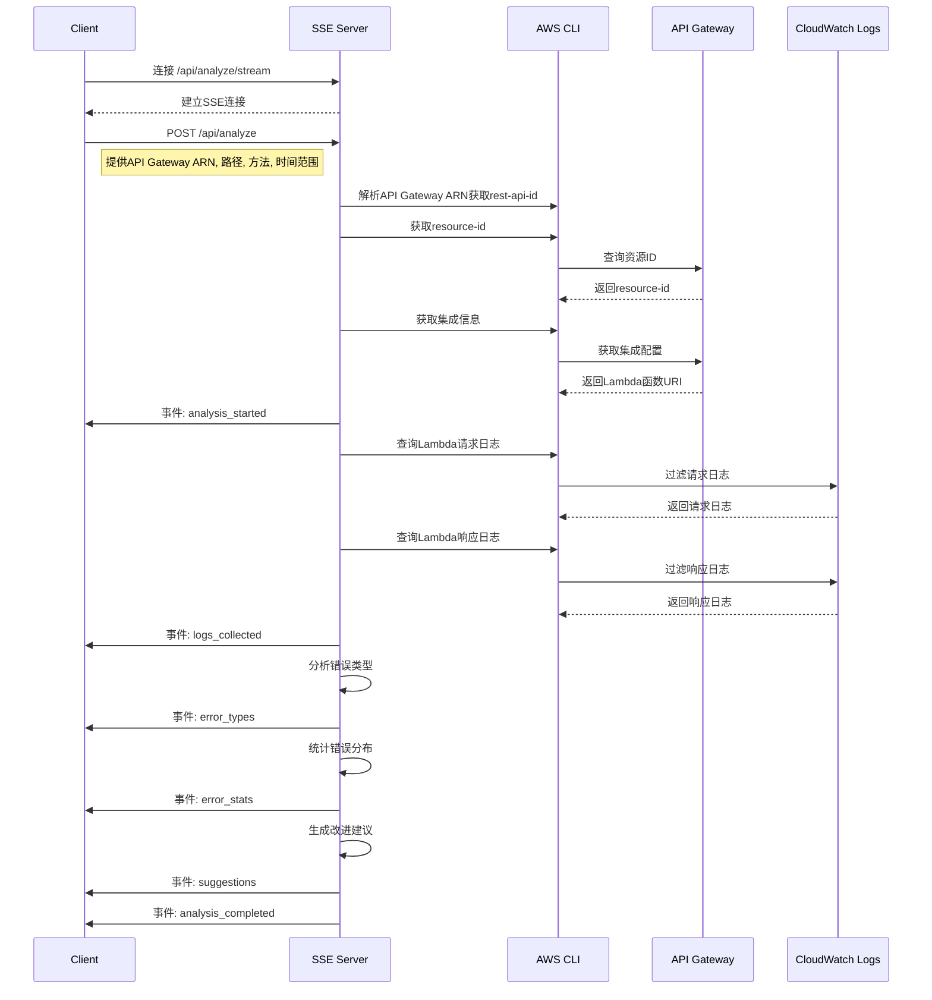

# AWS CloudWatch MCP

使用AI自动分析AWS CloudWatch日志，快速识别和解决API Gateway与Lambda集成中的错误。

## 项目概述

AWS CloudWatch 日志分析工具用于分析 Lambda 函数与 API Gateway 集成的日志，帮助用户快速定位和解决问题。通过提供API Gateway ARN，自动分析相关Lambda函数的日志，识别错误模式，并提供改进建议。

## 分析流程

以下序列图展示了完整的分析流程：

## 快速开始

请参考 [API文档](./api.md) 了解如何使用该服务。
